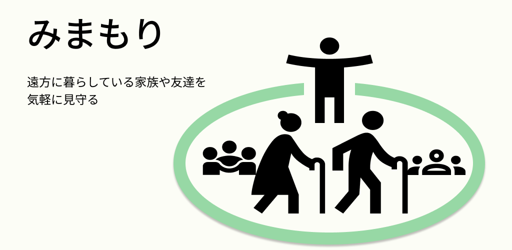
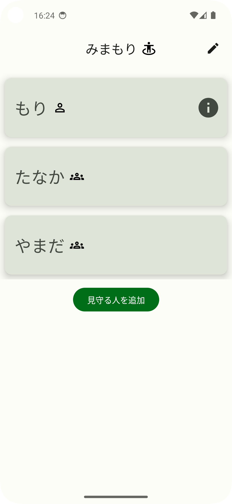
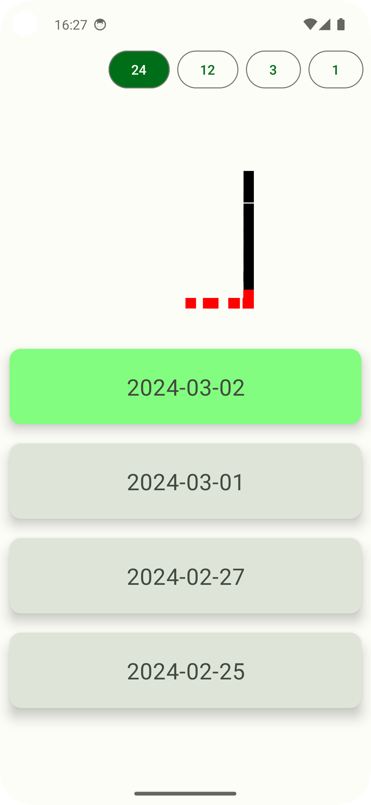

- [みまもりアプリ](#みまもりアプリ)
  - [アプリ情報](#アプリ情報)
  - [開発背景](#開発背景)
  - [使用した技術](#使用した技術)

# みまもりアプリ

- スマホの加速度センサから加速度を取得し、サーバーにアップロードすることで、ユーザのIDを知る他のユーザからリアルタイムで見守りができるアプリ

## アプリ情報
|アイコン                                          |フィーチャーグラフィック                                  |メイン画面                                           |詳細画面                                               |
|--------------------------------------------------|----------------------------------------------------------|-----------------------------------------------------|-------------------------------------------------------|
|||||

## 開発背景

見守りアプリは多数存在するが、位置情報や歩数での見守りが多い。しかし、この二つでは見守られる側のプライバシーが守られず、見守りというより監視されていると感じることが多いと考えた。このため、加速度のデータだけを使用して、どの程度動いたかをモニタリングすることで、プライバシーが守られ、より見守りに近くなると考えた。

## 使用した技術

|名前                 |説明                  |
|---------------------|----------------------|
|MVVM                 |アーキテクチャ        |
|GitHub Actions       |CI                    |
|JetPack Compose      |UIアプリ開発          |
|ktlint               |フォーマッター        |
|Hilt                 |依存性注入            |
|retrofit             |api通信               |
|moshi                |JSON parse            |
|Preferences DataStore|ユーザデータの永続化  |
|FOREGROUND SERVICE   |継続的なセンサ情報収集|
|MondoDB              |データベース          |
|Deno Deploy          |クラウド              |
|                     |                      |
